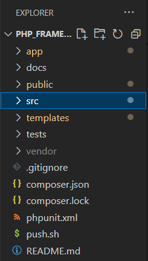
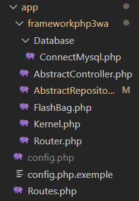
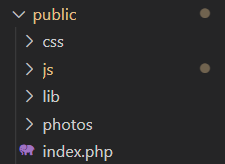
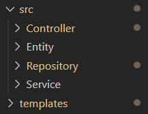

<h1>frameworkphp3wa</h1>
<a href='https://github.com/Heroszhen/frameworkphp3wa' target='_blank'>frameworkphp3wa</a> est un framework que le formateur Cyril nous a appris à créer il y a 2 ans. 
Nous pouvons le retrouver dans ce repository: <a href='https://github.com/Heroszhen/frameworkphp3wa' target='_blank'>https://github.com/Heroszhen/frameworkphp3wa</a>
 
Voici la structre de ce projet:

 
Les détailles:

  

Le framework est construit avec l'achitecture "MVC" : controlleur, vue et modèle. 
J'ai également créé des composants et installé des packages pour que le framework fonctionne comme un projet php normal:
<ul>
    <li>Bootstrap 4 : framework css</li>
    <li>FastRoute : système de routage</li>
    <li>FlashBag : composant servant à afficher des messages</li>
    <li>PDO : outil pour la connexion à MySql</li>
    <li>PHPUnit : outil de tests unitaires</li>
    <li>Twig : moteur de template</li>
</ul>
 
J'ai aussi importé jquery pour pouvoir utiliser des plugins , par exemple : ckeditor 4.